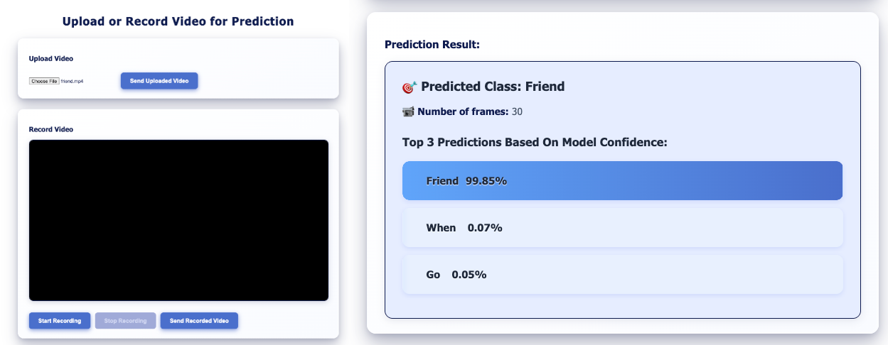

Gesture Recognition System – MSc Dissertation Project
This project presents a fully automated gesture recognition system, developed as part of a Final MSc Dissertation. The system leverages state-of-the-art computer vision and deep learning techniques to identify and classify human gestures in real time.

## **Project Files:**
- *BiLSTM.ipynb* containing the code to collect, preprocess, augment data and finally develop a BiLSTM model and train and test it the training and testing sets.
- *main.py* containing the backend logic for the Flask application.
- *Web.html* ctaoning both HTML and JavaScript code serving as the frontend of the Flask application.

## Workflow:

- Landmark Detection with MediaPipe
The system uses MediaPipe to detect key landmarks from human pose and hand movements in video sequences. This includes tracking body joints and hand positions, which are crucial for understanding gesture patterns.

- Feature Extraction and Vectorisation
Detected landmarks are processed and transformed into high-dimensional feature vectors, representing the spatial and temporal information of gestures across video frames. Each gesture is encoded into a structured format suitable for deep learning input.

- Custom Deep Learning Model
A custom deep learning model is trained on these feature vectors to classify gestures. The model has been designed to handle sequences of frames and capture temporal dependencies, enabling accurate recognition of dynamic gestures.

- Data Collection and Preprocessing
A custom video dataset was collected for model training. Preprocessing steps include standardisation, labelling, data augmentation, and uniform sampling to ensure robust model performance across different gesture sequences.

- Evaluation and Visualisation
Model performance is evaluated using metrics such as accuracy, confusion matrix, and classification reports. Visualisations of training/validation loss and accuracy are also provided to support analysis.
The model pre-trained weights are available on Google Drive:
https://drive.google.com/file/d/1cTuXcdwUC559cgprvulK7hY6t1KkZQ0F/view?usp=drive_link
- Deployment
The system is structured to be easily deployable, with a Flask backend (app.py) and a web interface (Web.html), enabling seamless interaction and live testing.

- Flask Application Interface:
  
